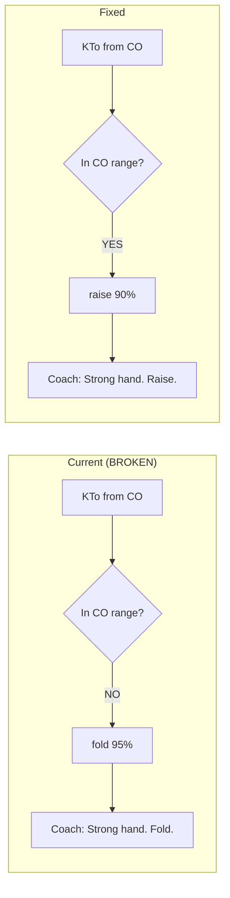
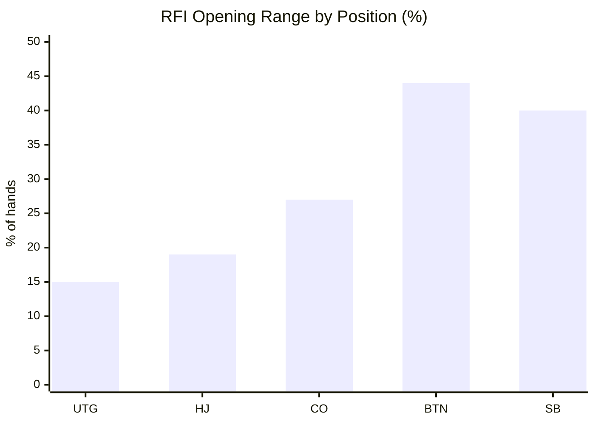

# Preflop Decision Flow — How KTo Gets to "Fold"

## The Full Pipeline

```mermaid
flowchart TD
    DEAL[Hero dealt K♦ T♥ on CO] --> CLASSIFY[classifyArchetype]

    CLASSIFY --> |"No one raised, hero first to act"| RFI[archetypeId: rfi_opening]

    RFI --> LOOKUP[lookupGtoFrequencies]

    LOOKUP --> |"street === preflop"| RANGES[preflopRanges.ts]

    RANGES --> HAND_CLASS[comboToHandClass: KTo]
    HAND_CLASS --> CHECK{isInRfiRange KTo, co?}

    CHECK --> |"KTo NOT in GTO_RFI_RANGES.co"| OUT_OF_RANGE[getRfiFrequencies returns fold: 95%, call: 3%, raise: 2%]
    CHECK --> |"KTo IS in range"| IN_RANGE[getRfiFrequencies returns fold: 5%, call: 5%, raise: 90%]

    OUT_OF_RANGE --> FREQ[ActionFrequencies: bet_medium: 2%, call: 3%, fold: 95%]
    IN_RANGE --> FREQ_GOOD[ActionFrequencies: bet_medium: 90%, call: 5%, fold: 5%]

    FREQ --> ENGINE[modifiedGtoEngine.decide]
    FREQ_GOOD --> ENGINE

    ENGINE --> |"GTO profile = identity modifier"| SAMPLE[sampleFromModifiedFrequencies]
    SAMPLE --> |"Random samples from distribution"| ACTION[Hero action: fold or raise]

    FREQ --> COACHING[Coaching Panel]
    FREQ_GOOD --> COACHING

    COACHING --> COMMENTATOR[commentateHand]
    COACHING --> GTO_ROW[GTO Row: shows frequencies]
    COACHING --> SOLUTION[GTO Solution: frequency bars]

    COMMENTATOR --> |"GTO is primary"| RECOMMENDATION[Coach recommendation]

    style CHECK fill:#4a2d2d,stroke:#ff6666
    style OUT_OF_RANGE fill:#4a2d2d,stroke:#ff6666
    style IN_RANGE fill:#2d4a2d,stroke:#66ff66
```

## Where KTo Goes Wrong

## Data Sources — Single Path

```mermaid
flowchart TD
    subgraph "ONE Source of Truth"
        RANGES_FILE[preflopRanges.ts<br/>GTO_RFI_RANGES per position]
    end

    subgraph "All Consumers"
        ENGINE_USE[Engine auto-play<br/>hero + villains]
        COACHING_USE[Coaching panel<br/>GTO recommendation]
        SCORING_USE[Scoring<br/>optimal/mistake verdict]
        SOLUTION_USE[GTO Solution display<br/>frequency bars]
    end

    RANGES_FILE --> |lookupGtoFrequencies| ENGINE_USE
    RANGES_FILE --> |lookupGtoFrequencies| COACHING_USE
    RANGES_FILE --> |computePreflopSolution| SCORING_USE
    RANGES_FILE --> |deriveSolutionFromCoaching| SOLUTION_USE

    style RANGES_FILE fill:#2d3d4a,stroke:#6b8f9f,stroke-width:3px
```

## Position Range Sizes (Standard GTO)

## All 5 Preflop Archetypes

```mermaid
flowchart TD
    PREFLOP{Preflop Decision} --> |"No raises yet"| RFI[RFI Opening<br/>getRfiFrequencies]
    PREFLOP --> |"Hero is BB, facing raise"| BB_DEF[BB Defense<br/>getBbDefenseFrequencies]
    PREFLOP --> |"Non-BB, facing raise"| THREE_BET[3-Bet Pots<br/>get3BetFrequencies]
    PREFLOP --> |"SB vs BB only"| BVB[Blind vs Blind<br/>getBvbFrequencies]
    PREFLOP --> |"Facing 3-bet or 4-bet"| FOUR_BET[4-Bet / 5-Bet<br/>get4BetFrequencies]

    RFI --> VALIDATED[preflopRanges.ts<br/>Validated GTO Ranges]
    BB_DEF --> VALIDATED
    THREE_BET --> VALIDATED
    BVB --> VALIDATED
    FOUR_BET --> VALIDATED

    VALIDATED --> ONE_ENGINE[ONE Engine<br/>modifiedGtoEngine.decide]
    ONE_ENGINE --> HERO[Hero auto-play]
    ONE_ENGINE --> VILLAIN[Villain auto-play]
    ONE_ENGINE --> COACH[Coaching display]

    style VALIDATED fill:#2d3d4a,stroke:#6b8f9f,stroke-width:3px
    style ONE_ENGINE fill:#2d4a2d,stroke:#6b8f6b,stroke-width:3px
```

