# System Data Flow — What the User Sees at Every Point

## Action → Data → User View

```mermaid
flowchart TD
    DEAL[Deal Hand] --> SM[State Machine Init]
    SM --> BLINDS[Post Blinds]
    BLINDS --> AUTOPLAY_PRE[Auto-play to Hero's Turn]

    AUTOPLAY_PRE --> HERO_TURN{Hero's Decision Point}

    %% ═══ WHAT HERO SEES ═══
    HERO_TURN --> CARDS[Hero Cards + Board]
    HERO_TURN --> PLAYERS[Player List]
    HERO_TURN --> POT[Pot + Odds]
    HERO_TURN --> ACTIONS[Legal Actions]
    HERO_TURN --> COACHING[Coaching Panel]
    HERO_TURN --> ANALYSIS[Analysis Lenses]

    %% ═══ COACHING PANEL HIERARCHY ═══
    COACHING --> COMMENTATOR[Hand Commentator — Coach Voice]
    COACHING --> ARCHETYPE[Archetype Badge — Educational Frame]
    COACHING --> OPP_STORY_C[Opponent's Story — Their Narrative]
    COACHING --> ACTION_STORIES[Your Possible Stories — Per-Action Narratives]
    COACHING --> GTO_REC[GTO Recommendation — Solver Data]
    COACHING --> PROFILES[Profile Rows — TAG/LAG/NIT/FISH]

    %% ═══ COACHING DEPENDENCIES ═══
    COMMENTATOR --> |composes| ARCH_CLASS[classifyArchetype]
    COMMENTATOR --> |composes| HAND_CAT[categorizeHand]
    COMMENTATOR --> |composes| OPP_STORY_ENGINE[buildOpponentStory]
    COMMENTATOR --> |composes| FREQ_LOOKUP[lookupGtoFrequencies — unified]
    COMMENTATOR --> |composes| ACTION_NAR[buildActionStories]

    GTO_REC --> FREQ_LOOKUP
    OPP_STORY_C --> OPP_STORY_ENGINE
    ACTION_STORIES --> ACTION_NAR
    ARCHETYPE --> ARCH_CLASS
    PROFILES --> ENGINE[modifiedGtoEngine.decide]
    ENGINE --> FREQ_LOOKUP

    OPP_STORY_ENGINE --> RANGE_EST[estimateRange]
    OPP_STORY_ENGINE --> EQ_VS_RANGE[equityVsRange]
    OPP_STORY_ENGINE --> BOARD_TEX[analyzeBoard]

    %% ═══ ANALYSIS LENSES ═══
    ANALYSIS --> HAND_STR[Hand Strength]
    ANALYSIS --> EQUITY[Equity vs Random — Monte Carlo]
    ANALYSIS --> THREATS[Threat Cards]
    ANALYSIS --> OUTS[Outs to Improve]
    ANALYSIS --> DRAWS[Draw Analysis]
    ANALYSIS --> OPP_READ[Opponent Read]

    HAND_STR --> HAND_CAT
    OPP_READ --> RANGE_EST
    OPP_READ --> EQ_VS_RANGE

    %% ═══ HERO ACTS ═══
    HERO_TURN --> HERO_ACT[Hero Acts]
    HERO_ACT --> SNAPSHOT[captureFullSnapshot — ALL data]
    HERO_ACT --> AUDIT_EVENT[Audit: Record Event + Coaching Snap]
    HERO_ACT --> STATE_ADV[State Machine Advance]

    STATE_ADV --> OPP_AUTO[Opponent Auto-play]
    OPP_AUTO --> ENGINE
    OPP_AUTO --> AUDIT_OPP[Audit: Opponent Decision + Narrative]

    OPP_AUTO --> STREET_CHG{Street Change?}
    STREET_CHG --> |yes| NEW_CARDS[Deal Community Cards]
    NEW_CARDS --> RECOMPUTE[Re-compute All Analysis]
    RECOMPUTE --> HERO_TURN
    STREET_CHG --> |no| NEXT_TURN{Next Actor}
    NEXT_TURN --> |hero| HERO_TURN
    NEXT_TURN --> |opponent| OPP_AUTO

    %% ═══ HAND ENDS ═══
    STREET_CHG --> |hand over| HAND_END[Hand Complete]
    NEXT_TURN --> |all fold| HAND_END
    HAND_END --> SHOWDOWN[Showdown / Winner]
    HAND_END --> AUDIT_FINAL[Audit: Finalize Record]

    %% ═══ OPPONENT DETAIL (click villain) ═══
    PLAYERS --> OPP_DETAIL[Opponent Detail Panel]
    OPP_DETAIL --> OPP_STORY_PANEL[Opponent's Story — Primary View]
    OPP_DETAIL --> ENGINE_INTERNALS[Engine Internals — Collapsed Toggle]
    OPP_DETAIL --> OPP_RANGE[Range + Equity vs Range]
    OPP_DETAIL --> FOLD_EQ[Fold Equity Scenarios]

    OPP_STORY_PANEL --> OPP_STORY_ENGINE

    %% ═══ PROGRAMMATIC API ═══
    SNAPSHOT --> |captures| SNAP_DATA[FullSnapshot Object]
    SNAP_DATA --> |contains| ALL_COACHING[Commentary + Archetype + Stories + GTO + Opponents]
    SNAP_DATA --> |contains| ALL_ANALYSIS[Hand Strength + Board Texture + Legal Actions]
    SNAP_DATA --> |contains| ALL_PLAYERS[Player States + Action History]
    SNAP_DATA --> |optional| DEBUG[Debug: Raw types for development]

    style COMMENTATOR fill:#4a3728,stroke:#d4a854
    style HERO_TURN fill:#2d4a2d,stroke:#6b8f6b
    style SNAPSHOT fill:#2d2d4a,stroke:#6b6b8f
    style AUDIT_EVENT fill:#4a2d2d,stroke:#8f6b6b
    style AUDIT_OPP fill:#4a2d2d,stroke:#8f6b6b
    style AUDIT_FINAL fill:#4a2d2d,stroke:#8f6b6b
    style FREQ_LOOKUP fill:#2d3d4a,stroke:#6b8f9f
```



## Capture Architecture

### captureFullSnapshot() — `convex/lib/analysis/snapshot.ts`

One function captures EVERYTHING the user sees at a decision point:

```typescript
const snapshot: FullSnapshot = captureFullSnapshot(gameState, heroSeat, heroCards, {
  debug: true,              // Include raw types for development
  opponentProfiles: Map,    // Villain profiles for story computation
  deadCards: [],             // Known dead cards
});
```

**Returns** (all fields populated, no gaps):

| Section | Fields | Source |
|---|---|---|
| **Context** | street, heroPosition, heroCards, communityCards, pot, potOdds | GameState |
| **Legal Actions** | canFold, canCheck, canCall, callAmount, canBet, canRaise, raiseMin/Max | currentLegalActions() |
| **Hand Assessment** | category, relativeStrength, description | categorizeHand() |
| **Board Analysis** | wetness, description, isPaired, isMonotone, flushPossible, straightHeavy | analyzeBoard() |
| **Archetype** | id, confidence, textureId | classifyArchetype() |
| **GTO Data** | gtoFrequencies, gtoSource, gtoOptimalAction | lookupGtoFrequencies() — unified |
| **Opponent Stories** | per-opponent: equity, rangePercent, confidence, narratives, adjustedAction | buildOpponentStory() |
| **Action Narratives** | per-action: narrative, counterNarrative | buildActionStories() |
| **Commentary** | narrative (full paragraph), summary, recommendedAction, confidence | commentateHand() |
| **Players** | per-seat: position, stack, status, committed, actionHistory | GameState |
| **Debug** (optional) | rawHandCat, rawArchetype, rawBoardTexture, rawGtoLookup, rawOpponentStories, rawLegal | Raw types |

### HandStepper — `convex/lib/analysis/handStepper.ts`

Programmatic API for stepping through hands without a browser:

```typescript
const stepper = new HandStepper({ numPlayers: 6, debug: true });

// Deal with specific cards
const step1 = stepper.deal([card("As"), card("Kh")]);
console.log(step1.formatted);  // Human-readable snapshot

// Hero acts manually
const step2 = stepper.act("call", 3);

// Or auto-play hero using GTO recommendations
const step3 = stepper.autoAct();

// Or play entire hand automatically
const result = stepper.playFullHand([card("Qs"), card("Qc")]);
// result.steps = all snapshots at each decision point
// result.heroActions = what hero did
// result.record = complete audit record
```

### formatSnapshot() — Human-Readable Output

```
=== PREFLOP | Button | A♠ K♥ ===
Pot: 4.5 BB | Odds: 2.5:1
Hand: strong starting hand (premium_pair, strength 0.82)
Archetype: rfi_opening (confidence 0.90)
Actions: Fold | Call 3.0 | Raise 6.0-100.0
GTO (preflop-handclass): raise_large: 85%, call: 10%, fold: 5% → raise_large
Opponent Small Blind (GTO): Range is moderate (~22% of hands).
  Equity vs range: 62% | Adjusted: bet
Action stories:
  fold: "I'm stepping aside — this hand isn't worth playing from here."
  call: "I'm calling to see a flop. My hand plays well postflop."
    → The math supports calling — you have enough equity.
  raise: "I'm raising to thin the field and build the pot."
    → You dominate their range. Raising extracts maximum value.

COACH (clear): You're on the Button with A♠ K♥. ...
```

## Data Each Component Produces (Audit Status)

### At Hero's Decision Point
| Component | Data Produced | Snapshot Captures | Audit Captures |
|---|---|---|---|
| **Hand Commentator** | `HandCommentary` | ✅ `commentary.*` | ✅ Via snapshot |
| **Archetype** | `ArchetypeClassification` | ✅ `archetype.*` | ✅ Via snapshot |
| **Hand Strength** | `HandCategorization` | ✅ `handStrength.*` | ✅ Via snapshot |
| **Action Narratives** | `ActionStory[]` | ✅ `actionStories[]` | ✅ Via snapshot |
| **Opponent Story** | `OpponentStory` | ✅ `opponentStories[]` | ✅ Via snapshot |
| **GTO Frequencies** | `ActionFrequencies` | ✅ `gtoFrequencies` | ✅ Via coaching snap + snapshot |
| **GTO Optimal** | `GtoAction` | ✅ `gtoOptimalAction` | ✅ Via coaching snap + snapshot |
| **Board Texture** | `BoardTexture` | ✅ `boardTexture.*` | ✅ Via snapshot |
| **Pot Odds** | ratio string | ✅ `potOdds` | ✅ Via snapshot |
| **Legal Actions** | `LegalActions` | ✅ `legalActions.*` | ✅ Via snapshot |
| **Equity vs Range** | per-opponent | ✅ `opponentStories[].equityVsRange` | ✅ Via snapshot |

### At Opponent's Decision Point
| Component | Audit Captures |
|---|---|
| **Engine Decision** | ✅ Decision snapshot with reasoning |
| **Narrative** | ✅ Via RenderedNarrative in engine decision |
| **GTO Base Frequencies** | ✅ In reasoning.gtoBaseFrequencies |
| **Modifier Applied** | ✅ In reasoning (foldScale, aggressionScale) |

### At Hand End
| Component | Audit Captures |
|---|---|
| **Winner/Outcome** | ✅ In finalized record |
| **Community Cards** | ✅ In finalized record |

## DRY Status

| Data | Coaching Panel | Opponent Detail | Analysis Lenses | Snapshot | Status |
|---|---|---|---|---|---|
| **Opponent range** | Via opponentStory | Via opponentStory | Via opponentRead | ✅ | ✅ DRY — `estimateRange()` |
| **Equity vs range** | Via opponentStory | Via opponentStory | Via opponentRead | ✅ | ✅ DRY — `equityVsRange()` |
| **Archetype** | Badge in coaching | Not shown | Not shown | ✅ | ⚠️ Computed 2x — cache per decision |
| **Hand category** | In commentator | Not shown | In hand strength | ✅ | ⚠️ Computed 3x — cache per decision |
| **Board texture** | In commentator | In opponentStory | In engine | ✅ | ⚠️ Computed 3x — cache per decision |
| **GTO frequencies** | In GTO row | Not shown | Not shown | ✅ | ✅ DRY — `lookupGtoFrequencies()` (unified) |
| **Action narratives** | In "Stories" | Not shown | Not shown | ✅ | ✅ DRY — single function |

## Key Files

### Core Pipeline (Pure TS — `convex/lib/`)
| File | Purpose |
|---|---|
| `analysis/snapshot.ts` | `captureFullSnapshot()` — all user-visible data in one object |
| `analysis/handStepper.ts` | `HandStepper` — programmatic hand play API |
| `analysis/handCommentator.ts` | `commentateHand()` — coach's narrative voice |
| `analysis/opponentStory.ts` | `buildOpponentStory()` — reads opponent actions |
| `analysis/coachingLens.ts` | Coaching orchestrator — runs all profiles + opponent story |
| `gto/frequencyLookup.ts` | `lookupGtoFrequencies()` — unified GTO lookup (engine + coaching) |
| `gto/actionNarratives.ts` | `buildActionStories()` — per-action narrative descriptions |
| `gto/narrativeContext.ts` | `buildBoardNarrative()` — board scene-setting |
| `gto/archetypeClassifier.ts` | `classifyArchetype()` — spot classification |
| `gto/handCategorizer.ts` | `categorizeHand()` — hand strength assessment |
| `opponents/engines/modifiedGtoEngine.ts` | Unified engine — all profiles use same GTO lookup |
| `opponents/engines/narrativeEngine.ts` | Narrative generation for profile decisions |
| `opponents/rangeEstimator.ts` | `estimateRange()` — range narrowing from actions |
| `analysis/opponentRead.ts` | `equityVsRange()` — equity against estimated range |
| `session/handSession.ts` | `HandSession` — game state orchestration |
| `audit/handRecorder.ts` | `HandRecorder` — event capture with coaching snapshots |

### UI Components (`src/components/`)
| File | Purpose |
|---|---|
| `workspace/workspace-shell.tsx` | Main workspace — board source selector, coaching section, commentary |
| `analysis/coaching-panel.tsx` | Coaching panel — commentator + archetype + stories + profiles |
| `table/opponent-detail.tsx` | Opponent detail — story first, engine internals collapsed |
| `drill/narrative-board-context.tsx` | Board narrative headline in drill mode |
| `drill/narrative-prompt.tsx` | "What's your story?" prompt (drill quiz mode) |
| `drill/narrative-feedback.tsx` | Post-action narrative feedback |

### Testing Infrastructure
| File | Purpose |
|---|---|
| `tests/analysis/handStepper.test.ts` | Programmatic hand play — 10 tests |
| `tests/analysis/handCommentator.test.ts` | Commentary generation — 7 tests |
| `tests/analysis/opponentStory.test.ts` | Opponent story engine — 11 tests |
| `tests/gto/actionNarratives.test.ts` | Action narratives — 8 tests |
| `tests/scenarios/captureTraces.test.ts` | Full hand traces — 10 scenarios |
| `tests/scenarios/batchValidation.test.ts` | 100-hand batch validation |
| `tests/scenarios/learnerSimulation.test.ts` | Educational effectiveness simulation |
| `tests/scenarios/agentBaseline.test.ts` | AI agent student baseline |

### Test Count: 1268 across 62 files. Zero tsc/lint errors.
