# System Data Flow — What the User Sees at Every Point

## Action → Data → User View

```mermaid
flowchart TD
    DEAL[Deal Hand] --> SM[State Machine Init]
    SM --> BLINDS[Post Blinds]
    BLINDS --> AUTOPLAY_PRE[Auto-play to Hero's Turn]

    AUTOPLAY_PRE --> HERO_TURN{Hero's Decision Point}

    %% ═══ WHAT HERO SEES ═══
    HERO_TURN --> CARDS[Hero Cards + Board]
    HERO_TURN --> PLAYERS[Player List]
    HERO_TURN --> POT[Pot + Odds]
    HERO_TURN --> ACTIONS[Legal Actions]
    HERO_TURN --> COACHING[Coaching Panel]
    HERO_TURN --> ANALYSIS[Analysis Lenses]

    %% ═══ COACHING BREAKDOWN ═══
    COACHING --> COMMENTATOR[Hand Commentator]
    COACHING --> ARCHETYPE[Archetype Badge]
    COACHING --> ACTION_STORIES[Your Possible Stories]
    COACHING --> OPP_STORY_C[Opponent's Story]
    COACHING --> GTO_REC[GTO Recommendation]
    COACHING --> PROFILES[Profile Rows]

    COMMENTATOR --> |reads| ARCH_CLASS[classifyArchetype]
    COMMENTATOR --> |reads| HAND_CAT[categorizeHand]
    COMMENTATOR --> |reads| OPP_STORY_ENGINE[buildOpponentStory]
    COMMENTATOR --> |reads| FREQ_LOOKUP[lookupGtoFrequencies]
    COMMENTATOR --> |reads| ACTION_NAR[buildActionStories]

    GTO_REC --> FREQ_LOOKUP
    OPP_STORY_C --> OPP_STORY_ENGINE
    ACTION_STORIES --> ACTION_NAR
    ARCHETYPE --> ARCH_CLASS
    PROFILES --> ENGINE[modifiedGtoEngine.decide]
    ENGINE --> FREQ_LOOKUP

    %% ═══ ANALYSIS BREAKDOWN ═══
    ANALYSIS --> HAND_STR[Hand Strength]
    ANALYSIS --> EQUITY[Equity vs Random]
    ANALYSIS --> THREATS[Threat Cards]
    ANALYSIS --> OUTS[Outs to Improve]
    ANALYSIS --> DRAWS[Draw Analysis]
    ANALYSIS --> OPP_READ[Opponent Read]

    HAND_STR --> HAND_CAT
    OPP_READ --> RANGE_EST[estimateRange]
    OPP_READ --> EQ_VS_RANGE[equityVsRange]

    %% ═══ HERO ACTS ═══
    HERO_TURN --> HERO_ACT[Hero Acts]
    HERO_ACT --> AUDIT_EVENT[Audit: Record Event]
    HERO_ACT --> COACHING_SNAP[Audit: Coaching Snapshot]
    HERO_ACT --> STATE_ADV[State Machine Advance]

    STATE_ADV --> OPP_AUTO[Opponent Auto-play]
    OPP_AUTO --> ENGINE
    OPP_AUTO --> AUDIT_OPP[Audit: Opponent Decision]

    OPP_AUTO --> STREET_CHG{Street Change?}
    STREET_CHG --> |yes| NEW_CARDS[Deal Community Cards]
    NEW_CARDS --> RECOMPUTE[Re-compute All Analysis]
    RECOMPUTE --> HERO_TURN
    STREET_CHG --> |no| NEXT_TURN{Next Actor}
    NEXT_TURN --> |hero| HERO_TURN
    NEXT_TURN --> |opponent| OPP_AUTO

    %% ═══ HAND ENDS ═══
    STREET_CHG --> |hand over| HAND_END[Hand Complete]
    NEXT_TURN --> |all fold| HAND_END
    HAND_END --> SHOWDOWN[Showdown / Winner]
    HAND_END --> AUDIT_FINAL[Audit: Finalize Record]

    %% ═══ OPPONENT DETAIL (click villain) ═══
    PLAYERS --> OPP_DETAIL[Opponent Detail Panel]
    OPP_DETAIL --> OPP_STORY_PANEL[Opponent's Story Section]
    OPP_DETAIL --> ENGINE_INTERNALS[Engine Internals - collapsed]
    OPP_DETAIL --> OPP_RANGE[Range + Equity vs Range]
    OPP_DETAIL --> FOLD_EQ[Fold Equity Scenarios]

    OPP_STORY_PANEL --> OPP_STORY_ENGINE
    OPP_RANGE --> RANGE_EST
    OPP_RANGE --> EQ_VS_RANGE

    style COMMENTATOR fill:#4a3728,stroke:#d4a854
    style HERO_TURN fill:#2d4a2d,stroke:#6b8f6b
    style AUDIT_EVENT fill:#4a2d2d,stroke:#8f6b6b
    style AUDIT_OPP fill:#4a2d2d,stroke:#8f6b6b
    style AUDIT_FINAL fill:#4a2d2d,stroke:#8f6b6b
    style COACHING_SNAP fill:#4a2d2d,stroke:#8f6b6b
```



## Data Each Component Produces (Audit Capture Points)

### At Hero's Decision Point
| Component | Data Produced | User Sees | Audit Captures Today | Gap |
|---|---|---|---|---|
| **Hand Commentator** | `HandCommentary { narrative, summary, recommendedAction, confidence }` | Full paragraph in coaching panel | ❌ Not captured | Need to capture |
| **Archetype** | `ArchetypeClassification { archetypeId, confidence, textureId }` | Badge: "3-Bet Pots · Preflop" | ❌ Not captured | Need to capture |
| **Hand Strength** | `HandCategorization { category, relativeStrength, description }` | "Weak Hand" / "Strong pair" | ❌ Not captured | Need to capture |
| **Hand Category** | `category: "air" \| "top_pair" \| ...` | Part of hand strength display | ❌ Not captured | Need to capture |
| **Action Narratives** | `ActionStory[] { action, narrative, counterNarrative }` | "If you fold: ..." per action | ❌ Not captured | Need to capture |
| **Opponent Story** | `OpponentStory { streetNarratives, rangeNarrative, adjustedAction, equity }` | In coaching panel + opponent detail | ❌ Not captured | Need to capture |
| **GTO Frequencies** | `ActionFrequencies { fold, call, bet_*, raise_* }` | Frequency bars in solution display | ✅ Via solverData in coaching snap | OK |
| **GTO Optimal Action** | `optimalAction: GtoAction` | Highlighted in solution | ✅ Via coaching snap | OK |
| **Equity vs Random** | `EquityResult { win, tie, lose }` | Equity bar: "45% Win" | ❌ Not captured | Need to capture |
| **Equity vs Range** | `EquityResult` (opponent-read) | "51% vs their range" | ❌ Not captured | Need to capture |
| **Pot Odds** | `callAmount / (pot + callAmount)` | "Pot: 14.5 BB · Call: 10 BB · Odds: 2.5:1" | ❌ Not captured | Need to capture |
| **Legal Actions** | `LegalActions { canFold, canCall, callAmount, canRaise, ... }` | Fold/Call/Raise buttons | ❌ Not captured | Need to capture |

### At Opponent's Decision Point
| Component | Data Produced | User Sees (after click) | Audit Captures Today | Gap |
|---|---|---|---|---|
| **Engine Decision** | `EngineDecision { actionType, narrative, reasoning }` | In opponent detail panel | ✅ decision snapshot | OK (but missing narrative) |
| **Narrative** | `RenderedNarrative { oneLiner, paragraph, character }` | Character paragraph | ❌ Not in audit event | Need to capture |
| **GTO Base Frequencies** | `ActionFrequencies` (from unified lookup) | In engine internals | ✅ In reasoning.gtoBaseFrequencies | OK |
| **Modifier Applied** | `effectiveFoldScale, effectiveAggressionScale` | In engine internals | ✅ In reasoning | OK |

### At Hand End
| Component | Data Produced | User Sees | Audit Captures Today | Gap |
|---|---|---|---|---|
| **Winner** | `outcome { winners, handRanks }` | "V4 WINS · One Pair" | ✅ | OK |
| **Community Cards** | `CardIndex[]` | Board display | ✅ | OK |
| **Drill Score** | `ActionScore { verdict, evLoss }` | Verdict badge + EV | ❌ Not in hand audit | Drill-specific |

## DRY Check: Same Data in Multiple Places

| Data | Coaching Panel | Opponent Detail | Analysis Lenses | Audit | DRY? |
|---|---|---|---|---|---|
| **Opponent range** | Via opponentStory | Via opponentStory | Via opponentRead lens | ❌ | ✅ Same function (`estimateRange`) |
| **Equity vs range** | Via opponentStory | Via opponentStory | Via opponentRead lens | ❌ | ✅ Same function (`equityVsRange`) |
| **Archetype** | Badge in coaching | Not shown | Not shown | ❌ | ⚠️ Computed 2x (coaching + commentator) — should cache |
| **Hand category** | In commentator | Not shown | In hand strength lens | ❌ | ⚠️ Computed 3x — should cache |
| **Board texture** | In commentator | In opponentStory | In boardTexture engine | ❌ | ⚠️ Computed 3x — should cache |
| **GTO frequencies** | In GTO profile row | Not shown | Not shown | ✅ coaching snap | ✅ Single lookup |
| **Action narratives** | In "Your Possible Stories" | Not shown | Not shown | ❌ | ✅ Single function |

## Programmatic API Needed

To step through a hand without the browser, we need:

```typescript
// Step 1: Initialize
const session = new HandSession(config);
session.startHand(stacks, cardOverrides, communityCards);

// Step 2: At each hero decision point
const snapshot = captureFullSnapshot(session);
// Returns: everything the user would see
// {
//   heroCards, communityCards, pot, legalActions, potOdds,
//   handStrength, archetype, commentary, opponentStories,
//   actionStories, gtoFrequencies, equityVsRandom, equityVsRange,
//   playerStates, actionHistory
// }

// Step 3: Hero acts
session.act(actionType, amount);

// Step 4: Auto-play advances, repeat from Step 2

// Step 5: Hand ends
const record = session.finalize();
// Returns: full audit with all snapshots
```

This `captureFullSnapshot()` function is the key missing piece.
It runs ALL the analysis that the UI would show and captures it in one object.
The programmatic test loop then evaluates the snapshots for coherence.
